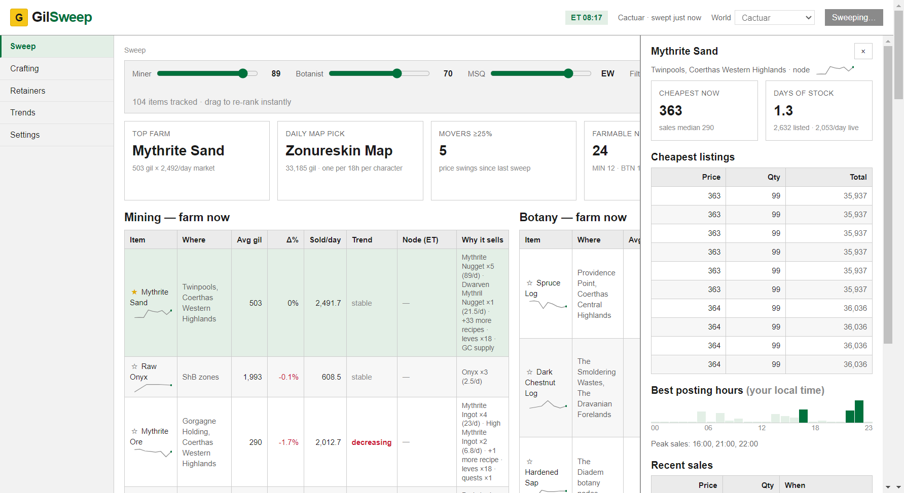
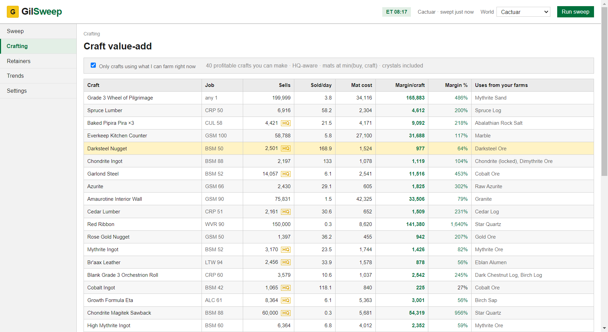
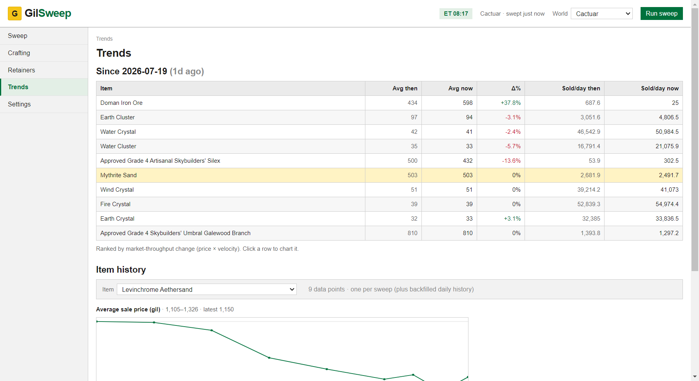

# GilSweep ⛏️

A local desktop app (Electron) that answers one question: **what should you farm for gil this week in FFXIV**, given your gatherer levels and MSQ progress.

Pulls live Universalis price/velocity aggregates and Saddlebag Exchange trends for a curated database of gatherable items, explains *why* each item sells (recipe consumers, leve turn-ins, GC supply — from Garland Tools data), re-ranks instantly as you drag your MIN/BTN level and expansion sliders, and turns your top farmables into a retainer selling plan (undercut price, stack size that actually sells, market saturation) from live listings. A live Eorzea clock ⏰ shows up-now / next-window timers on every timed node.

## Screenshots 🖼️

**The sweep dashboard** — sliders re-rank instantly; every item carries a price sparkline, node spawn window, and a "why it sells" demand breakdown:



**Market drill-down** — click any row for live listing depth, days of stock, and the hours buyers actually buy:


**Craft value-add** — HQ-aware margins for recipes that use what you farm:



**Trends** — week-over-week digest and per-item history charts from your local snapshot archive:



## Download 📦

From [Releases](https://github.com/hazeliscoding/gil-sweep/releases):

- **`gil-sweep-x.y.z-setup.exe`** — installer; **auto-updates** from GitHub releases.
- **`gil-sweep-x.y.z-portable.exe`** — no install, run from anywhere; re-download to update.

Both are unsigned, so SmartScreen will warn on first run (More info → Run anyway).

## Run it (dev) 🛠️

```
npm run setup   # once: installs desktop + renderer deps (Node 20+)
npm run dev     # Angular dev server + Electron window
```

## Package (portable Windows exe) 🚀

```
npm run package:win   # -> desktop/release/gil-sweep-<version>-portable.exe
```

## Architecture 🏗️

```
Angular renderer  --IPC-->  Electron main  -->  Universalis / Saddlebag (live prices)
   (sliders re-rank locally)            \-->  JSON snapshots (userData) + bundled item DB
```

- `desktop/src/main/` — Electron main: sweep engine, market API clients, snapshot persistence.
- `desktop/renderer/` — Angular 18 standalone renderer; all ranking/filtering happens client-side over the latest snapshot, so slider changes are instant (no refetch).
- `desktop/data/` — curated item DB and demand signals (recipe consumers, leves, GC supply) shipped with the app.

Snapshots and config live in the OS user-data folder; nothing leaves your machine except the market API calls.

The item database (`desktop/data/`) is maintainer-curated: every entry's node/location is verified against Garland Tools, and top-selling trap items (FC submarine loot, vendor flips) are tracked but never recommended as farms.

## Credits 🙏

- [Universalis](https://universalis.app/) — market board prices and sale velocities
- [Saddlebag Exchange](https://saddlebagexchange.com/) — market trend states
- [Garland Tools](https://garlandtools.org/) — item, node, and recipe data

## License & disclaimer ⚖️

Apache-2.0 (see `LICENSE`). FINAL FANTASY XIV is a registered trademark of Square Enix Holdings Co., Ltd. This project is a fan-made market tool: it is not affiliated with or endorsed by Square Enix, does not interact with the game client, and only reads community market APIs.
