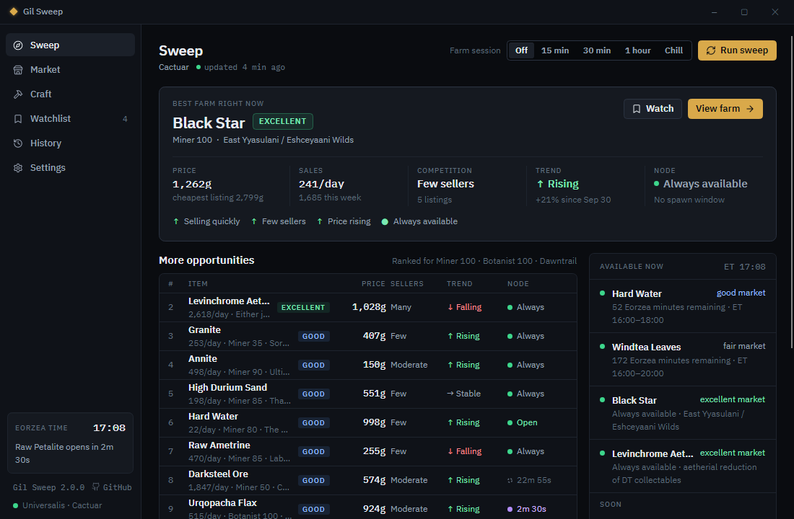
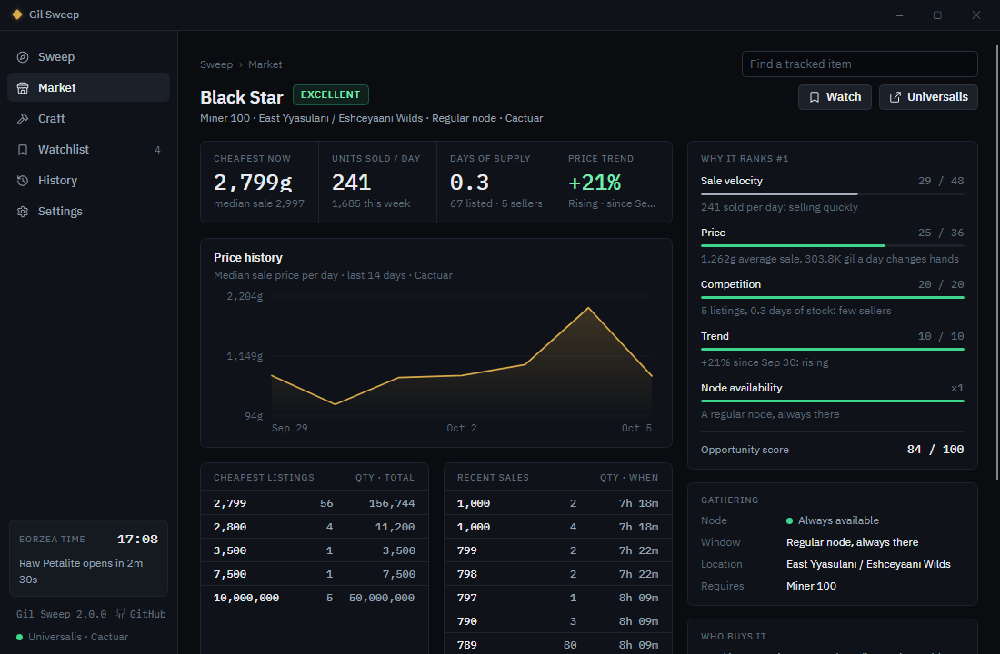
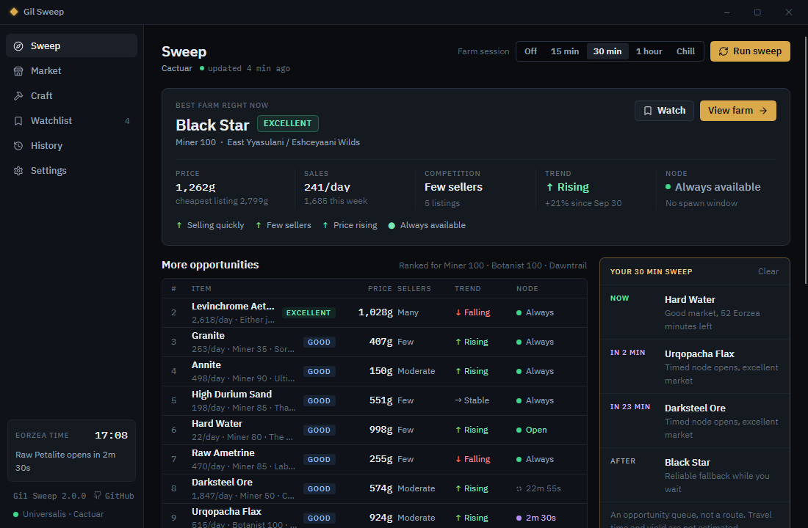
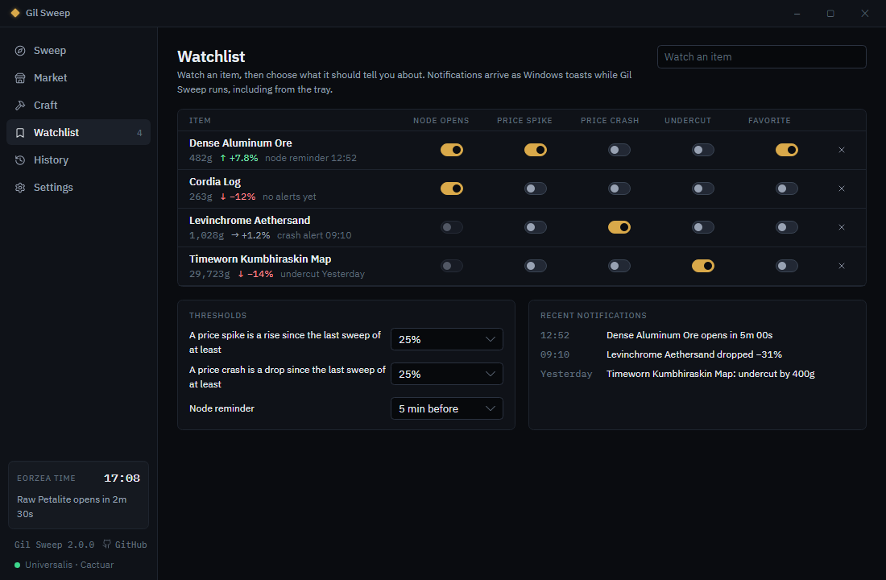

<p align="center"></p>

<h1 align="center">Gil Sweep</h1>

**What should I farm for gil right now?** Gil Sweep prices the gatherables worth tracking on your FINAL FANTASY XIV world, checks how crowded each market board is and which way prices are moving, follows the Eorzea clock for timed nodes, and puts the best farm you can go and gather this minute at the top, with the reasons why.

It is a Windows desktop app. Everything it learns stays on your computer.



## Install

Download the latest release from [Releases](https://github.com/hazeliscoding/gil-sweep/releases):

- `gil-sweep-setup-win-x64.exe` installs Gil Sweep for your Windows user, with no administrator prompt, adds it to the Start menu and keeps it up to date. Uninstall it from Windows Settings → Apps; your settings and history stay.
- `gil-sweep-portable-win-x64.zip` is the same app as a portable copy. Unzip it anywhere and run `GilSweep.exe`. A portable copy doesn't update itself.

Both are self-contained: no .NET install is needed. Check downloads against `SHA256SUMS` on the release page. The builds are not code-signed yet, so Windows SmartScreen may ask you to confirm the first run.

**Coming from Gil Sweep 1 (the Electron app)?** Version 1 doesn't update itself to 2. Install version 2 with Setup; on first start it brings over your world, levels, watched items, tracked items and sweep history. Then uninstall version 1.

## Using the app

| | |
|---|---|
| **Sweep** | The best farm right now and why: price, sales, competition, trend and whether the node is open. More opportunities ranked below, what is open now and what opens soon, the daily map pick, a craft worth processing, and an optional **Farm Session**: pick 15 minutes to "Chill" and get a queue of what to gather now, which timed nodes open while you play, and a fallback. |
| **Market** | One item in depth: live listings and recent sales, two weeks of prices, the hours it sells, days of stock on the board, why it ranks where it does, where and when to gather it, who buys it, and what to list it at. |
| **Craft** | Sell a material raw or process it first? For each material you farm, its best recipe at current prices, with locked recipes shown against your crafter levels. |
| **Watchlist** | Watch an item, then choose what it tells you about: a reminder before its node opens, price spikes and crashes, undercuts of your retainers, or simply marking it a favorite. |
| **History** | Your sweeps, what topped each one, the week's movers, a short summary, and a CSV export. |
| **Settings** | World, gatherer and crafter levels, story progress, folklore books, retainer names, tray and hourly sweeps, tracked items, local data and updates. |





## How recommendations work

Each item gets an **opportunity score** from 0 to 100: how much gil changes hands for it on your world each day, how many days of stock already sit on the market board, which way its price moved over the past week, and, for timed nodes, how long until you can gather it. Every recommendation shows those signals with the facts behind them.

Gil Sweep never shows gil per hour. It doesn't know how much a node gives, how long the trip is or how fast you gather, so it compares markets instead of pretending. The full method, with a worked example, is in [docs/opportunity-scoring.md](docs/opportunity-scoring.md).

Only items you can actually gather are ranked: your levels and story progress gate them, and top sellers that aren't gathered at all (vendor flips, submarine loot) are tracked but never recommended.

## Notifications and the tray

While Gil Sweep runs, it sweeps every hour and checks the Eorzea clock. Watched items send Windows notifications: a reminder a few minutes before a node opens, a price spike or crash since the last sweep, or someone listing below your retainers. Closing the window keeps Gil Sweep in the tray, where the icon shows the Eorzea time and the next node windows; quit from its menu.



## Your data

Settings, sweep history and the alert log live in `%AppData%\GilSweep`. Gil Sweep has no accounts, no cloud and no telemetry. It talks to:

- [Universalis](https://universalis.app/) for prices, sales and listings, and [Saddlebag Exchange](https://saddlebagexchange.com/) for trend states, when it sweeps;
- [XIVAPI](https://v2.xivapi.com/) and [Garland Tools](https://garlandtools.org/) only when you add an item in Settings;
- GitHub to check for updates, in an installed copy, when that is turned on.

The list of tracked items ships with the app and was compiled from Garland Tools: every node and spawn window was checked. Details are in [docs/data-sources.md](docs/data-sources.md).

## Build from source

```powershell
dotnet build
dotnet test --project tests/GilSweep.Tests          # offline, against recorded market data
dotnet run --project src/GilSweep.Desktop            # set GIL_SWEEP_HOME to keep your own profile out of it
dotnet run --project tools/GilSweep.Screenshots -- docs/screenshots
```

.NET 10 SDK, Windows. The app is Avalonia 12 with CommunityToolkit.Mvvm; all behavior is in `src/GilSweep.Core`. See [docs/architecture.md](docs/architecture.md).

## Credits

- [Universalis](https://universalis.app/): market board prices, sales and listings
- [Saddlebag Exchange](https://saddlebagexchange.com/): market trend states
- [Garland Tools](https://garlandtools.org/) and [XIVAPI](https://xivapi.com/): item, node and recipe data
- Sibling app: [XIV Vault](https://github.com/hazeliscoding/xiv-vault)

## License and disclaimer

Apache-2.0 (see `LICENSE`); bundled fonts and icons are listed in `THIRD-PARTY-NOTICES.md`. FINAL FANTASY XIV is a registered trademark of Square Enix Holdings Co., Ltd. Gil Sweep is a fan-made market tool: it is not affiliated with or endorsed by Square Enix, does not interact with the game client, and only reads community market APIs.
